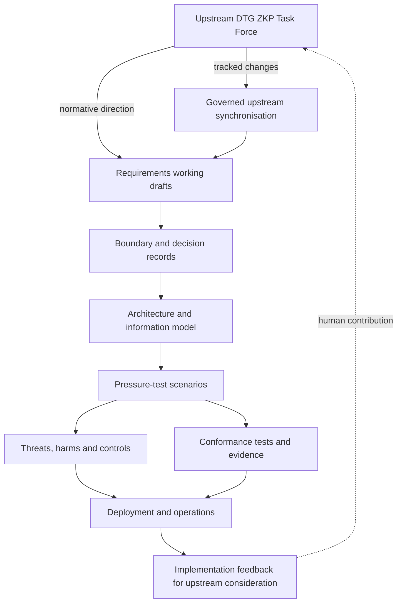

# DTG ZKP Implementation and Interoperability Fork

This repository is a maintained fork of [`trustoverip/dtgwg-zkp-tf`](https://github.com/trustoverip/dtgwg-zkp-tf). It preserves the upstream task force work while developing implementation, interoperability, assurance, deployment and conformance material around the emerging DTG zero-knowledge proof specification.

> **Fork status:** this repository is not the authoritative DTG ZKP specification repository. Normative decisions remain with the upstream DTG ZKP Task Force unless and until they are adopted there.

## Why this fork exists

The upstream repository is intentionally compact and specification-focused. This fork provides a separate engineering workspace in which unresolved specification ideas can be pressure-tested against implementation realities before being proposed upstream.

The fork currently develops five connected layers:

1. **Requirements maturation** — turning conceptual liveness and personhood requirements into bounded, testable statements.
2. **Implementation architecture** — defining actors, trust boundaries, information flows, protocol viewpoints and deployment patterns.
3. **Security and privacy assurance** — making threats, harms, controls, disclosure surfaces and residual risks explicit.
4. **Interoperability and conformance** — maintaining scenarios, test matrices, evidence schemas and an executable conformance harness.
5. **Operational adoption** — documenting rollout, recovery, revocation, migration, incident and governance procedures required beyond the proof system itself.

The objective is not to create a competing specification. It is to make the specification easier to implement, challenge and improve.

## Upstream fidelity

The upstream README is preserved separately as [`UPSTREAM_README.md`](./UPSTREAM_README.md). It records the upstream project framing without forcing fork-specific material into the upstream narrative.

The relationship is deliberately asymmetric:

- **Upstream** defines the task force mission, specification direction and normative decisions.
- **This fork** develops implementation evidence, pressure tests, proposed refinements and operational material.
- Upstream changes are monitored and integrated into this fork only through the governed process described in [`docs/governance/upstream-synchronisation.md`](./docs/governance/upstream-synchronisation.md).
- Fork additions do not silently redefine an upstream requirement. Where the fork makes a proposed decision, the status must be explicit.

This separation keeps the original upstream project identity intact while allowing the root README of this fork to accurately describe what a visitor will actually find here.

## Current focus: proof of liveness

The principal normative-adjacent work item is [`proof-of-liveness-requirements.md`](./proof-of-liveness-requirements.md).

The fork's v0.4 working draft advances the upstream v0.3 material by adding:

- explicit liveness, personhood, continuity and uniqueness terminology;
- an actor and trust model;
- a distinction between **capture freshness**, **attestation freshness** and **proof freshness**;
- requirement identifiers for review and traceability;
- transcript, replay, audience and context-binding requirements;
- revocation, suspension, expiry and policy-version handling;
- privacy requirements expressed against named adversaries and correlation horizons;
- failure and degraded-mode semantics;
- minimum interoperability evidence and conformance expectations; and
- a decision backlog separating specification choices from construction choices.

It remains a working draft and deliberately does **not** select a proof system or claim that cryptography proves the correctness of a biometric determination.

## Start here

Choose the path that matches what you are trying to do:

- **Understand the upstream task force:** [`UPSTREAM_README.md`](./UPSTREAM_README.md)
- **Review liveness/personhood requirements:** [`proof-of-liveness-requirements.md`](./proof-of-liveness-requirements.md)
- **Navigate the implementation workspace:** [`docs/implementation-guide/README.md`](./docs/implementation-guide/README.md)
- **Review DTG cross-repository dependencies:** [`docs/implementation-guide/interoperability/README.md`](./docs/implementation-guide/interoperability/README.md)
- **Inspect cross-specification pressure tests:** [`docs/implementation-guide/pressure-tests/README.md`](./docs/implementation-guide/pressure-tests/README.md)
- **Take a role-based learning path:** [`docs/implementation-guide/guided-learning.md`](./docs/implementation-guide/guided-learning.md)
- **Review assurance/disclosure boundaries:** [`docs/implementation-guide/boundaries/README.md`](./docs/implementation-guide/boundaries/README.md)
- **Pressure-test use cases:** [`docs/implementation-guide/scenarios/README.md`](./docs/implementation-guide/scenarios/README.md)
- **Inspect conformance evidence:** [`docs/implementation-guide/conformance/README.md`](./docs/implementation-guide/conformance/README.md)
- **Review threats, harms and controls:** [`docs/implementation-guide/security/README.md`](./docs/implementation-guide/security/README.md)
- **Understand fork/upstream governance:** [`docs/governance/upstream-synchronisation.md`](./docs/governance/upstream-synchronisation.md)

## Architecture of the workspace



The loop is intentional: implementation evidence should be able to expose ambiguity or unsafe assumptions in a requirement, but adoption upstream remains a human governance decision.

## What this fork does not claim

This repository does not claim that:

- a zero-knowledge proof establishes that a biometric liveness determination was correct;
- holder-key control proves human continuity, non-transferability or agent authority;
- a scoped nullifier proves global one-human-one-record uniqueness;
- privacy can be stated without identifying the adversary, context and time horizon;
- an implementation profile is normative merely because it is documented or tested here; or
- operational, accreditation and governance assurance can be replaced by cryptographic validity.

A recurring design rule across this fork is therefore:

> **The cryptography carries the privacy properties it can actually prove. The surrounding governance and assurance system carries the claims the cryptography cannot.**

## Documentation site

The implementation and interoperability guide is published through GitHub Pages:

<https://sankarshanmukhopadhyay.github.io/dtgwg-zkp-tf/>

Markdown under `docs/implementation-guide/` is validated for navigation and publication consistency. Mermaid diagrams are rendered through the repository's documentation build.

## Local quality gates

Run the principal validation suite from the repository root:

```sh
python3 scripts/validate_docs.py
python3 scripts/validate_conformance.py
python3 scripts/validate_style.py
python3 scripts/validate_links.py
python3 scripts/validate_fixtures.py
python3 scripts/validate_upstream_policy.py
python3 scripts/validate_interoperability.py
python3 scripts/validate_conformance_harness.py
python3 scripts/build_traceability.py
```

Additional validators cover diagrams, navigation, site output, deployment profiles, decision governance and security assurance. v0.4.0 also adds governed DTG dependency validation and deterministic interoperability cases to the executable harness.

## Contributing

When proposing material intended to influence the upstream specification:

1. distinguish **upstream text**, **fork interpretation**, **proposed requirement**, **implementation profile** and **open decision**;
2. state what each predicate establishes and does not establish;
3. name the privacy adversary and correlation horizon;
4. avoid selecting a cryptographic construction before its required privacy and trust boundaries are known; and
5. provide implementation or conformance evidence where a recommendation depends on deployability.

The upstream drafting conventions are preserved in [`DRAFTING-RULES.md`](./DRAFTING-RULES.md).

## Licensing and provenance

This fork inherits and preserves upstream provenance. See [`LICENSE`](./LICENSE) and the upstream project framing in [`UPSTREAM_README.md`](./UPSTREAM_README.md). Source code and documentation should continue to follow the applicable upstream/JDF licensing terms and retain attribution when upstream content is carried forward.
