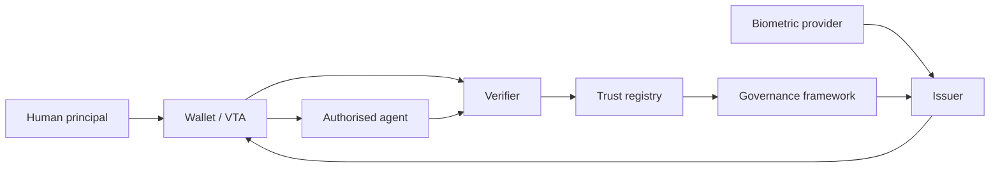

# D-001 — System context

```mermaid
flowchart LR
    H[Human principal] --> W[Wallet / VTA]
    BP[Biometric provider] --> I[Issuer]
    I --> W
    W --> A[Authorised agent]
    W --> V[Verifier]
    A --> V
    V --> R[Trust registry]
    R --> G[Governance framework]
    G --> I
```

The architecture separates evidence production, attestation, proof generation, delegated
execution, verification, accreditation discovery, and governance.
