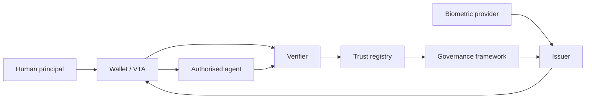

# D-001 — System context

The architecture separates evidence production, attestation, proof generation, delegated
execution, verification, accreditation discovery, and governance.

## Interpretation

The diagram identifies the principal actors and trust-service dependencies. It should be read with the system-context and ownership documents, which define the authority and evidence carried across each interaction.
