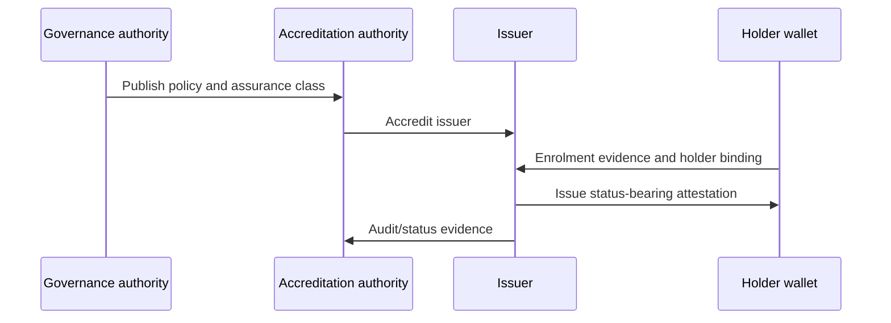

# Issuance flow

## Interpretation

Issuance depends on governance and accreditation before cryptographic proof use. The credential records the policy and assurance basis rather than implying that proof mechanics created the assurance.
