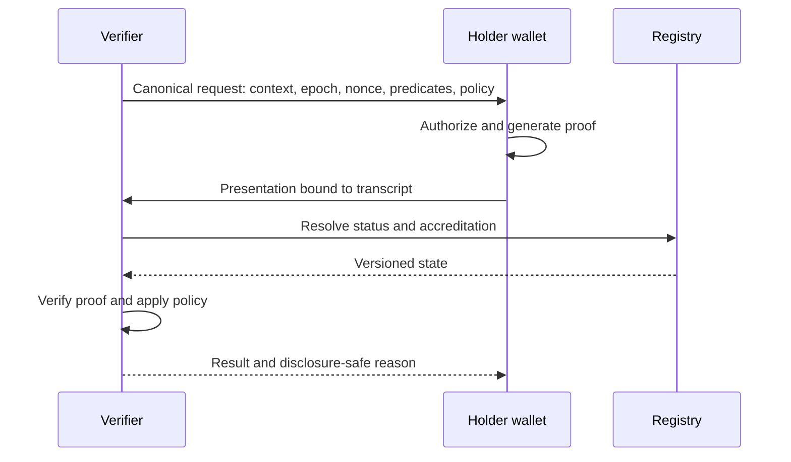

# Presentation and verification flow

## Interpretation

Verification combines proof validity with policy, status and accreditation. The resulting decision receipt records which versions and evidence supported the outcome.
