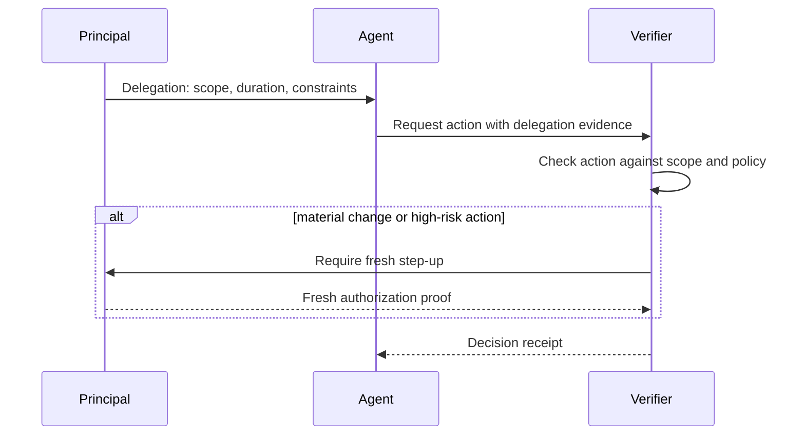

# Agent delegation and step-up flow

## Interpretation

Agent key control is insufficient. The verifier evaluates delegation scope and can require the principal to provide fresh authorization when risk, environment or requested permissions change.
