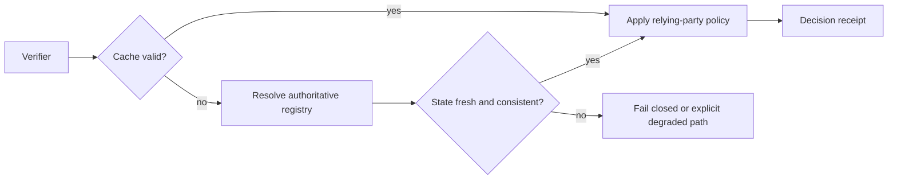

# Registry resolution flow

## Interpretation

Registry discovery, state publication, recognition and reliance remain separate decisions. Cached or unavailable state follows an explicit policy and is recorded in the decision receipt.
