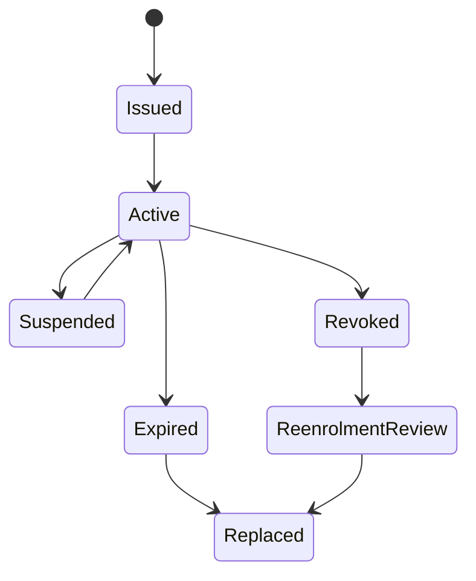

# Lifecycle flow

```mermaid
stateDiagram-v2
 [*] --> Issued
 Issued --> Active
 Active --> Suspended
 Suspended --> Active
 Active --> Revoked
 Active --> Expired
 Expired --> Replaced
 Revoked --> ReenrolmentReview
 ReenrolmentReview --> Replaced
```

## Interpretation

Lifecycle transitions are authority-controlled and time-bound. Recovery or replacement does not erase prior revocation, duplicate-use or audit evidence.
