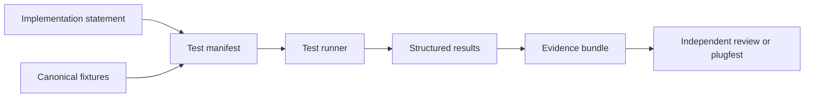

# Conformance evidence flow

## Interpretation

A conformance claim is supported by a reproducible evidence bundle that identifies the implementation, profile, environment, fixtures, results and exceptions.
