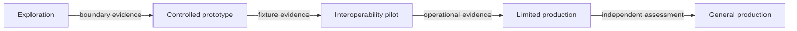

# Adoption maturity pathway

## Interpretation

Advancement is authorized by evidence-based gates. No stage transition is automatic.

## Assurance use

Use this diagram with the applicable deployment profile, scenario, threat-control mapping and evidence record. The diagram is explanatory; the linked records remain authoritative.
