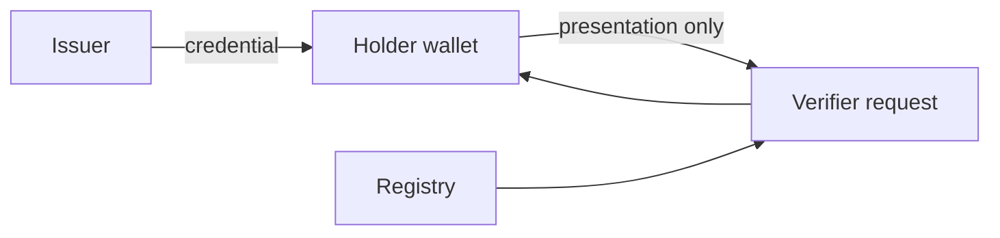

# Local proving deployment

## Interpretation

Credentials and witnesses remain in the holder zone. The verifier receives a bounded presentation.

## Assurance use

Use this diagram with the applicable deployment profile, scenario, threat-control mapping and evidence record. The diagram is explanatory; the linked records remain authoritative.
