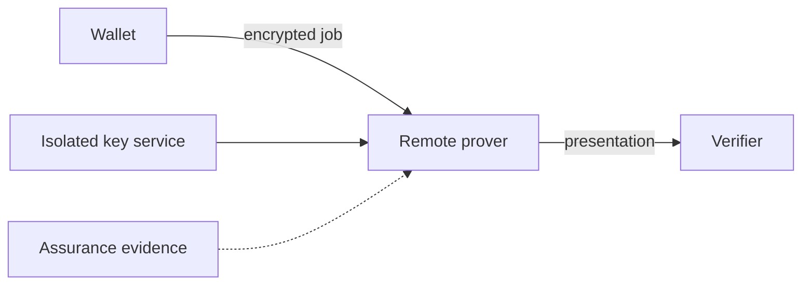

# Remote proving deployment

## Interpretation

The remote prover is an additional observation and administrative boundary requiring non-retention evidence.

## Assurance use

Use this diagram with the applicable deployment profile, scenario, threat-control mapping and evidence record. The diagram is explanatory; the linked records remain authoritative.
