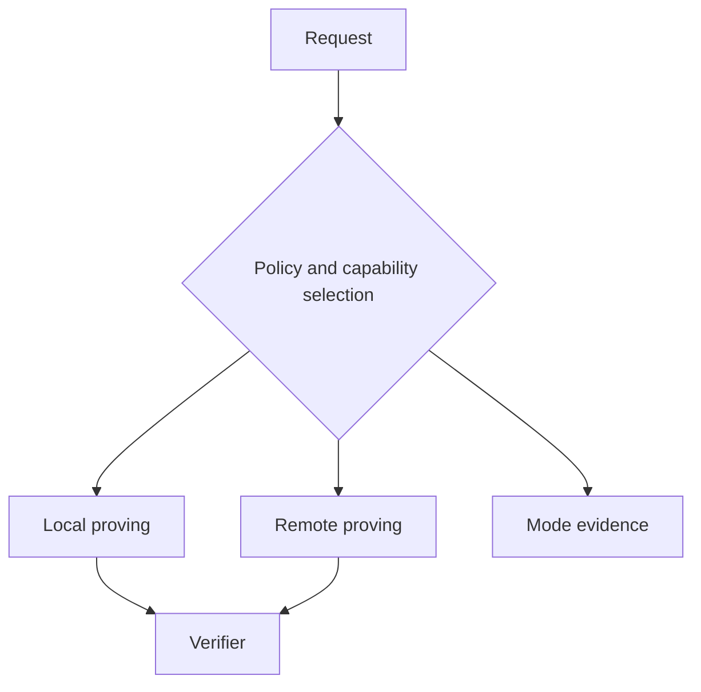

# Hybrid proving deployment

## Interpretation

Selection and fallback are policy decisions. Silent downgrade to a more observable mode is prohibited.

## Assurance use

Use this diagram with the applicable deployment profile, scenario, threat-control mapping and evidence record. The diagram is explanatory; the linked records remain authoritative.
