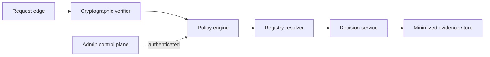

# Secure verifier topology

## Interpretation

Cryptographic, policy, registry and administrative authority are separated into authenticated zones.

## Assurance use

Use this diagram with the applicable deployment profile, scenario, threat-control mapping and evidence record. The diagram is explanatory; the linked records remain authoritative.
