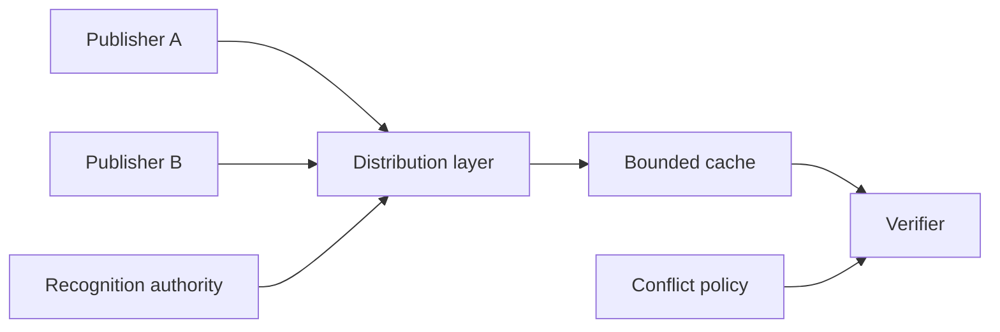

# Federated registry topology

## Interpretation

Distribution does not rewrite authority. Conflict and freshness behavior are explicit.

## Assurance use

Use this diagram with the applicable deployment profile, scenario, threat-control mapping and evidence record. The diagram is explanatory; the linked records remain authoritative.
