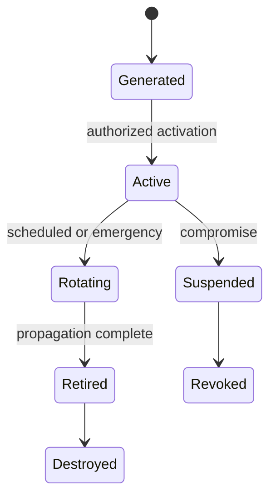

# Key and trust-anchor lifecycle

## Interpretation

Every transition has an authority, effective time and evidence record.

## Assurance use

Use this diagram with the applicable deployment profile, scenario, threat-control mapping and evidence record. The diagram is explanatory; the linked records remain authoritative.
