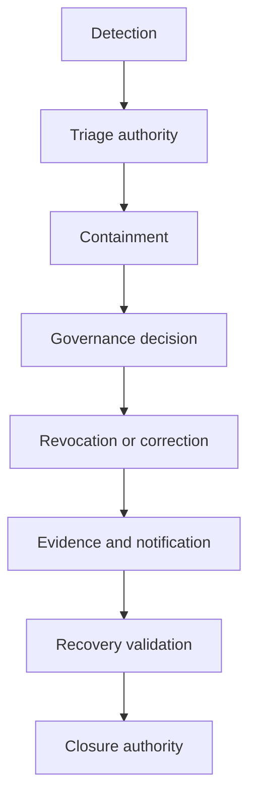

# Incident authority and escalation

## Interpretation

Operational responders contain; authorized governance actors change authority or status.

## Assurance use

Use this diagram with the applicable deployment profile, scenario, threat-control mapping and evidence record. The diagram is explanatory; the linked records remain authoritative.
