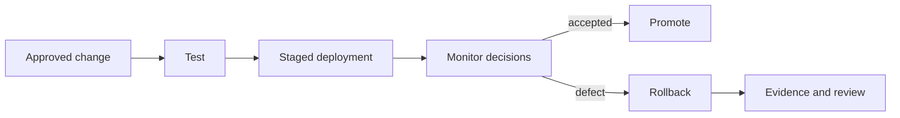

# Policy update and rollback

## Interpretation

Policy deployment is versioned, tested and reversible. Rollback authority is preassigned.

## Assurance use

Use this diagram with the applicable deployment profile, scenario, threat-control mapping and evidence record. The diagram is explanatory; the linked records remain authoritative.
