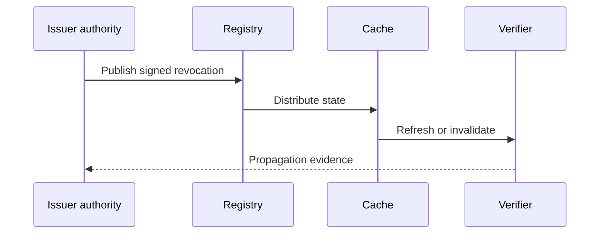

# Revocation propagation

## Interpretation

Propagation is measured from authoritative effective time to verifier observation.

## Assurance use

Use this diagram with the applicable deployment profile, scenario, threat-control mapping and evidence record. The diagram is explanatory; the linked records remain authoritative.
