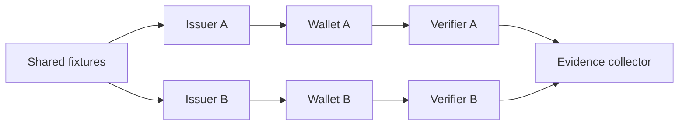

# Multi-implementation plugfest

## Interpretation

Independent control and shared fixtures distinguish interoperability from single-stack integration.

## Assurance use

Use this diagram with the applicable deployment profile, scenario, threat-control mapping and evidence record. The diagram is explanatory; the linked records remain authoritative.
