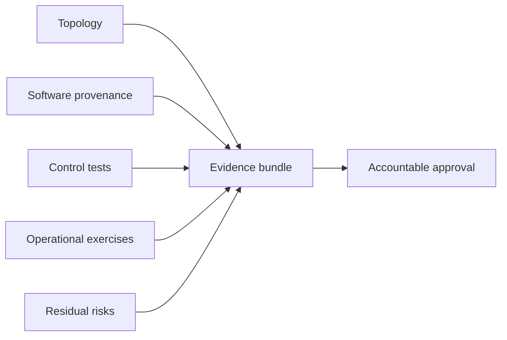

# Deployment evidence flow

## Interpretation

Production readiness is supported by versioned design, implementation and operational evidence.

## Assurance use

Use this diagram with the applicable deployment profile, scenario, threat-control mapping and evidence record. The diagram is explanatory; the linked records remain authoritative.
