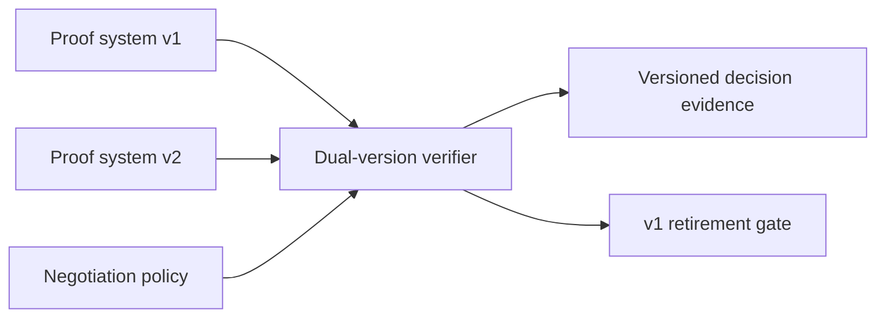

# Proof-system migration

## Interpretation

Overlap supports migration while negotiation policy prevents downgrade and ambiguous acceptance.

## Assurance use

Use this diagram with the applicable deployment profile, scenario, threat-control mapping and evidence record. The diagram is explanatory; the linked records remain authoritative.
