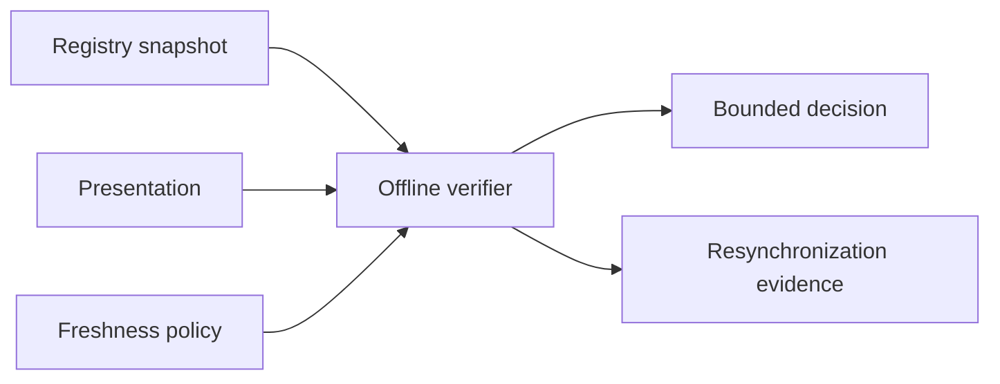

# Offline verification boundary

## Interpretation

Offline acceptance is bounded by snapshot provenance, expiry and the approved assurance horizon.

## Assurance use

Use this diagram with the applicable deployment profile, scenario, threat-control mapping and evidence record. The diagram is explanatory; the linked records remain authoritative.
