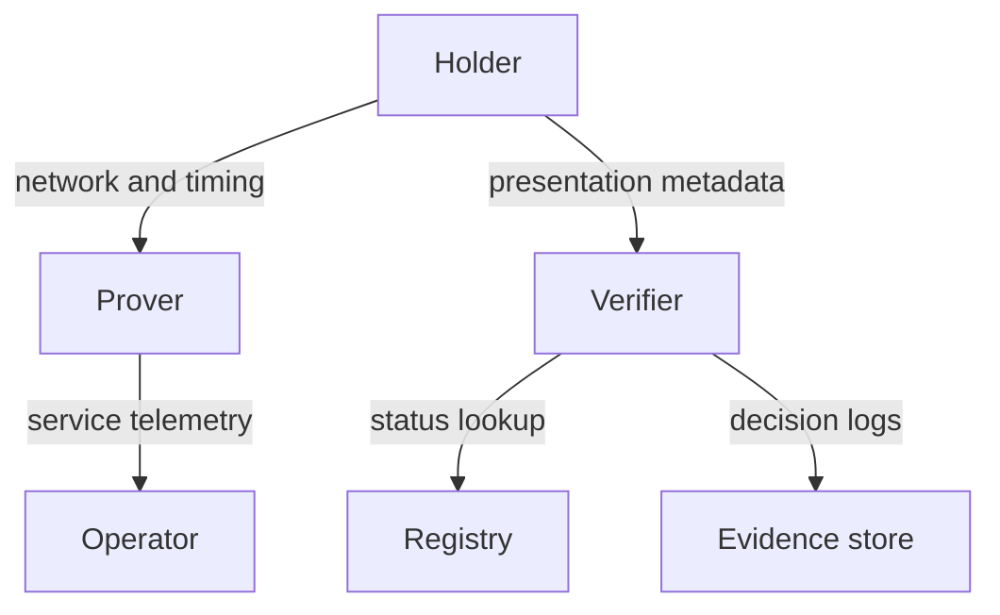

# Correlation surface map

## Interpretation

The map identifies observable events so minimization and retention controls can be tested.

## Assurance use

Use this diagram with the applicable deployment profile, scenario, threat-control mapping and evidence record. The diagram is explanatory; the linked records remain authoritative.
