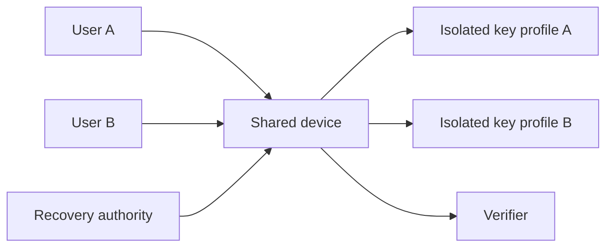

# Shared-device threat boundaries

## Interpretation

User, key, consent, history and recovery state require separation on a shared device.

## Assurance use

Use this diagram with the applicable deployment profile, scenario, threat-control mapping and evidence record. The diagram is explanatory; the linked records remain authoritative.
