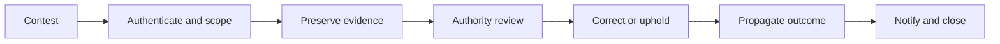

# Redress and correction flow

## Interpretation

Redress connects affected persons to the authority capable of correcting source state and downstream reliance.

## Assurance use

Use this diagram with the applicable deployment profile, scenario, threat-control mapping and evidence record. The diagram is explanatory; the linked records remain authoritative.
