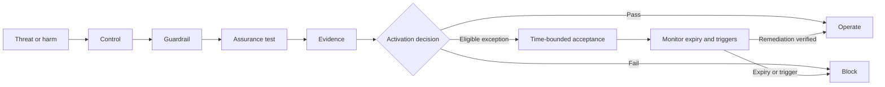

# Security Guardrail Gate Flow

```mermaid
flowchart LR
 T[Threat or harm] --> C[Control]
 C --> G[Guardrail]
 G --> A[Assurance test]
 A --> E[Evidence]
 E --> X{Activation decision}
 X -->|Pass| O[Operate]
 X -->|Fail| B[Block]
 X -->|Eligible exception| R[Time-bounded acceptance]
 R --> M[Monitor expiry and triggers]
 M -->|Expiry or trigger| B
 M -->|Remediation verified| O
```

## Interpretation

Controls reduce risk; guardrails gate authority; evidence determines whether operation is permitted.
