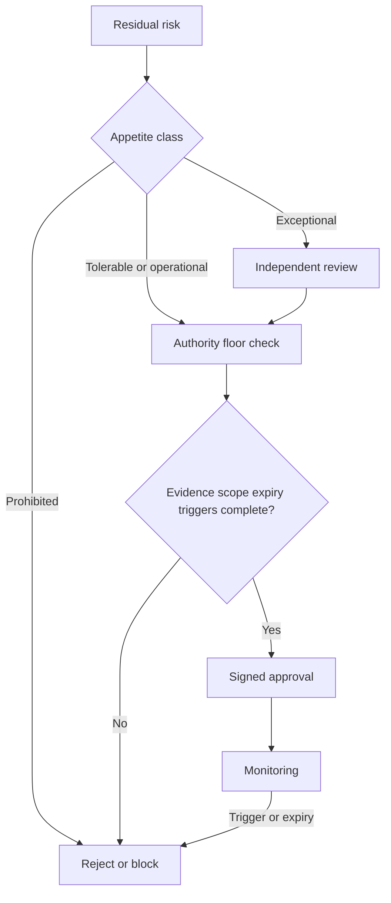

# Risk Acceptance Authority Flow

```mermaid
flowchart TD
 R[Residual risk] --> A{Appetite class}
 A -->|Prohibited| B[Reject or block]
 A -->|Exceptional| I[Independent review]
 A -->|Tolerable or operational| O[Authority floor check]
 I --> O
 O --> E{Evidence scope expiry triggers complete?}
 E -->|No| B
 E -->|Yes| S[Signed approval]
 S --> M[Monitoring]
 M -->|Trigger or expiry| B
```

## Interpretation

Acceptance is valid only when authority, evidence, scope, expiry and revocation triggers are complete.
