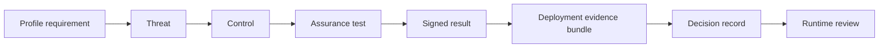

# Control Assurance Evidence Chain

```mermaid
flowchart LR
 P[Profile requirement] --> T[Threat]
 T --> C[Control]
 C --> Z[Assurance test]
 Z --> E[Signed result]
 E --> D[Deployment evidence bundle]
 D --> Q[Decision record]
 Q --> R[Runtime review]
```

## Interpretation

The evidence chain preserves traceability from profile claim to operating decision and later review.
