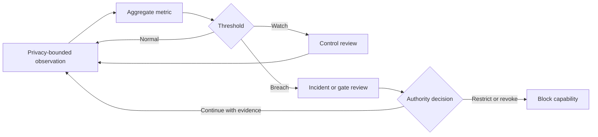

# Security Metric Escalation Loop

```mermaid
flowchart LR
 O[Privacy-bounded observation] --> M[Aggregate metric]
 M --> T{Threshold}
 T -->|Normal| O
 T -->|Watch| V[Control review]
 T -->|Breach| I[Incident or gate review]
 V --> O
 I --> D{Authority decision}
 D -->|Continue with evidence| O
 D -->|Restrict or revoke| B[Block capability]
```

## Interpretation

Metrics are decision inputs; they must not become person-level monitoring infrastructure.
