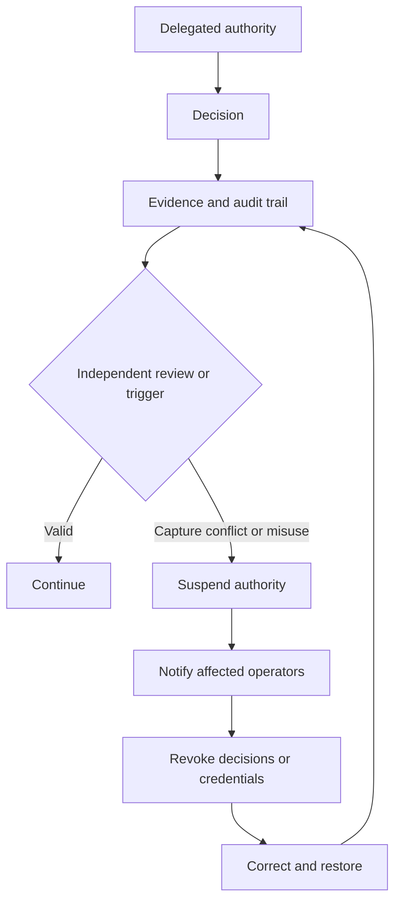

# Governance Capture and Revocation

```mermaid
flowchart TD
 A[Delegated authority] --> D[Decision]
 D --> E[Evidence and audit trail]
 E --> R{Independent review or trigger}
 R -->|Valid| C[Continue]
 R -->|Capture conflict or misuse| S[Suspend authority]
 S --> N[Notify affected operators]
 N --> X[Revoke decisions or credentials]
 X --> K[Correct and restore]
 K --> E
```

## Interpretation

Governance authority is bounded by evidence, review, suspension, revocation and correction.
