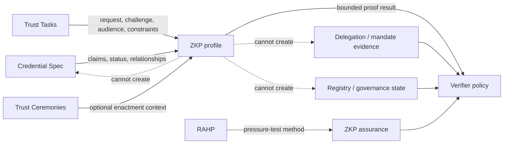

# D-030 — DTG ZKP dependency map

The diagram is intentionally directional: adjacent DTG specifications provide governed semantics or evidence to the ZKP profile, while ZKP returns only a bounded proof result. It does not acquire authority over the source specification.

## Interpretation

Credential, Trust Task, ceremony, registry and governance work feed bounded semantics or evidence into the ZKP profile. The ZKP profile can return a proof result to verifier policy, but it cannot create or supersede the source authority. RAHP contributes an assurance method rather than runtime authority.
