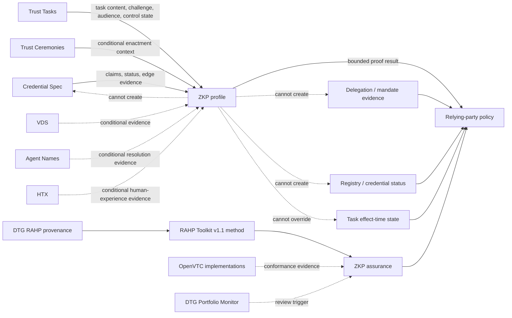

# D-030 — DTG ZKP dependency map



The diagram is intentionally directional. Adjacent DTG work supplies governed semantics, runtime state, optional composition inputs or assurance evidence. ZKP returns only a bounded cryptographic result.

## Dependency classes

- **Solid semantic/runtime edges** are load-bearing when the relevant profile is used.
- **Dotted conditional edges** are examined but do not become dependencies until a ZKP profile selects the composition.
- **Implementation evidence** can demonstrate conformance or expose defects but cannot redefine normative semantics.
- **The Portfolio Monitor** can trigger review but has no authority to change ZKP assumptions.
- **RAHP Toolkit v1.1** is the fork's operational pressure-test method; DTG RAHP remains upstream/historical method provenance and neither becomes ZKP normative authority.

## Interpretation

The consuming decision remains a composition of bounded proof validity, current external authority/state and relying-party policy:

```text
proof result
  + current task/control state
  + credential/registry status
  + delegation/mandate evidence
  + applicable policy
  -> relying-party decision
```

A change in any load-bearing external state can require re-evaluation even when the cryptographic proof itself remains mathematically valid.
