# Registry Authority and Status State Model

```mermaid
stateDiagram-v2
    [*] --> Unknown
    Unknown --> Recognised: recognition authority approves
Evidence: recognition record + effective time
    Recognised --> Authorised: scope authority grants scope
Evidence: authorisation record + policy version
    Authorised --> Active: activation conditions satisfied
Evidence: signed active state
    Active --> Suspended: suspension authority acts
Evidence: reason class + effective time
    Suspended --> Active: reinstatement authority acts
Evidence: reinstatement record
    Active --> Revoked: revocation authority acts
Evidence: revocation record + effective time
    Suspended --> Revoked: revocation authority acts
Evidence: revocation record + effective time
    Active --> Expired: validity horizon reached
Evidence: signed validity metadata
    Active --> Superseded: replacement becomes authoritative
Evidence: replacement relationship
    Recognised --> Revoked: recognition withdrawn
Evidence: withdrawal record
    Revoked --> [*]
    Expired --> [*]
    Superseded --> [*]
```

## Interpretation

The model separates discovery from recognition, scoped authorisation and current operational validity. A registry consumer must not infer authority merely because a record exists. Every governance-driven transition has an attributable decision authority, effective time and evidence record. `Revoked`, `Expired` and `Superseded` are shown as terminal for the specific record instance; restoration should create a new governed state or explicit replacement relationship rather than silently rewriting history.

`Unknown` is not equivalent to `Revoked`, `Not recognised` or `Unavailable`. Implementations should preserve enough versioned evidence to reconstruct the state that was authoritative for a historical decision time.
