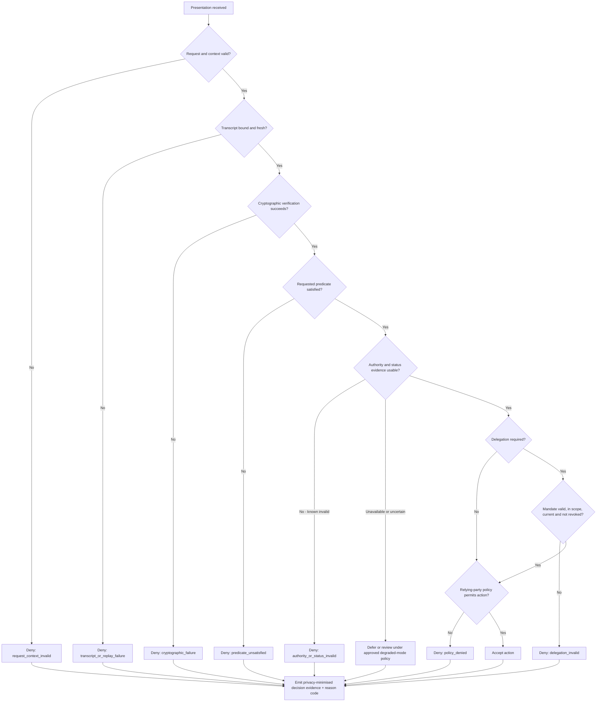

# Verifier Decision and Failure Pipeline

## Interpretation

Cryptographic verification is one gate in a larger relying-party decision. The diagram deliberately prevents a single `verified=true` result from collapsing transcript integrity, predicate semantics, issuer or registry authority, status, delegation and policy into one outcome. Each gate produces a distinct stable reason code and evidence sufficient to explain the decision without retaining unnecessary credential or proof content.

The `Defer or review` branch is governed behaviour, not an implicit fail-open. It is permitted only where an approved degraded-mode policy defines the affected scope, maximum duration, prohibited actions and review obligation.
