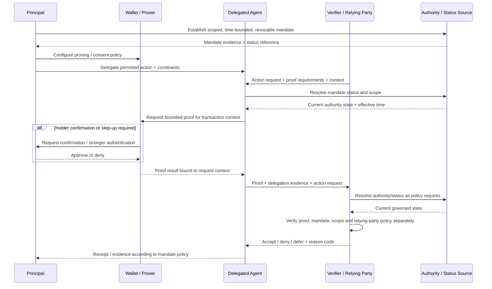

# Delegated-Agent Authority Transaction

## Interpretation

The principal is the source of delegated intent, but the relying party decides whether the requested action is acceptable under its policy. The wallet controls proof capability, the agent exercises only the delegated scope, and the authority/status source makes mandate state independently verifiable. Possession of proof material, successful proof generation and valid agent identity do not independently establish permission to act.

A step-up returns authority-sensitive control to the principal rather than allowing the agent to expand its mandate. Revocation at the authority/status source must prevent future reliance within the profile's approved propagation horizon and leave evidence of the effective transition.
