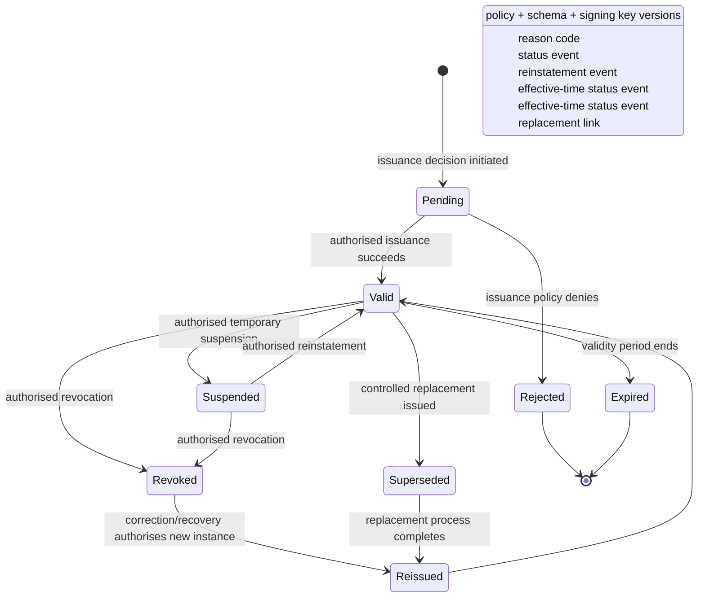

# Credential and Issuer Lifecycle States

## Interpretation

Credential lifecycle is distinct from issuer-key lifecycle. A signing-key compromise may invalidate confidence in a set of credentials without meaning that each holder committed wrongdoing; an incorrect individual issuance may require correction without compromising the issuer's entire signing authority. Implementations should record which authority caused each state transition, when the change became effective, how it was published and how replacement or re-issuance relates to the previous credential.

Historical status must not be destroyed when a credential is replaced. A verifier auditing a prior decision needs to recover the state and key/policy context that applied at that earlier time.
