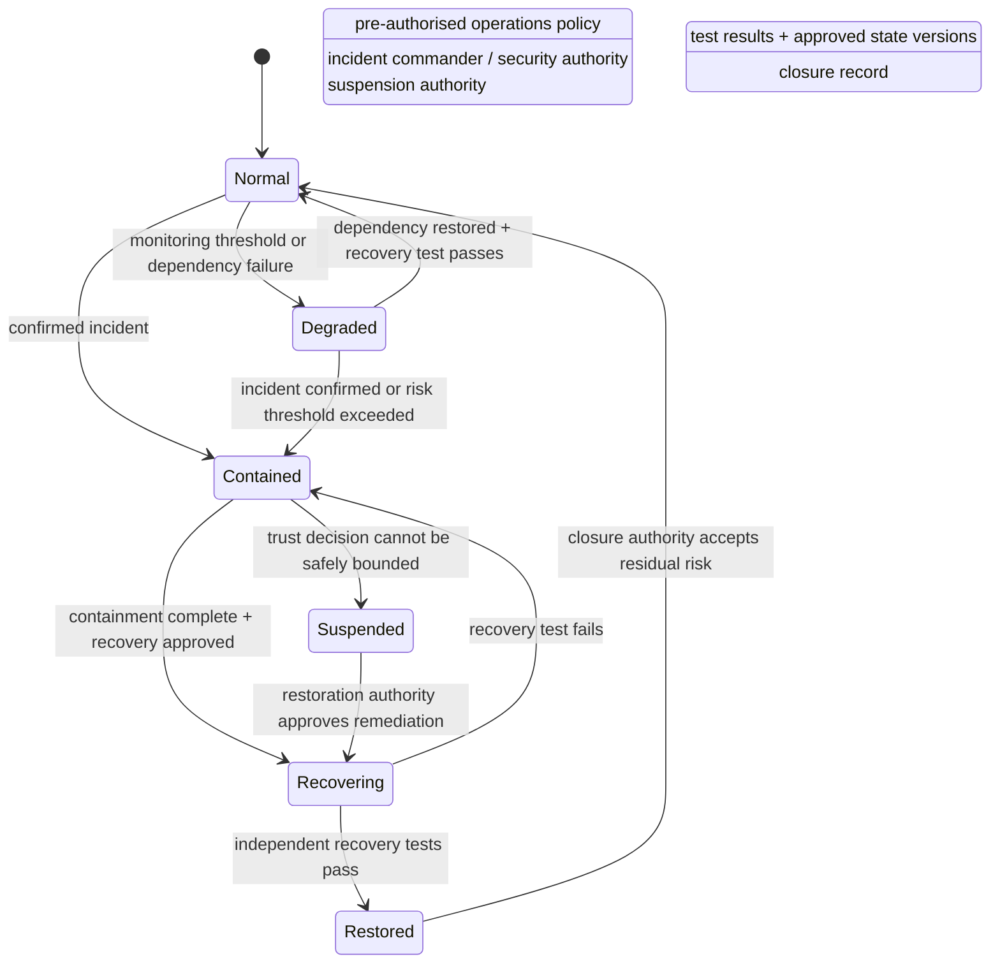

# Operational Incident Lifecycle

## Interpretation

Operational state changes are governance decisions. Detection alone does not grant authority to suspend a trust service, and technical recovery alone does not authorise restoration. Each runbook therefore names who may classify, contain, suspend, restore and close the event, and which evidence supports those transitions.

`Degraded` is a bounded operating mode with explicit prohibitions and expiry. It must not become an indefinite weaker-assurance state. `Restored` is intentionally separate from `Normal` so that post-recovery evidence, monitoring and closure can be completed before normal governance assumptions resume.
