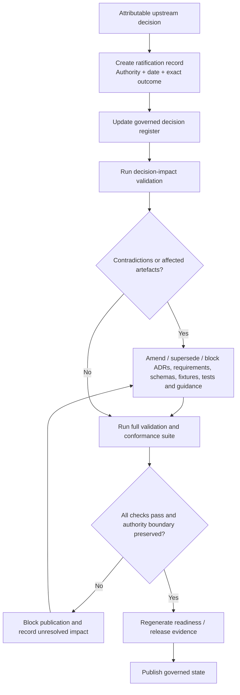

# Decision Ratification and Impact Propagation

## Interpretation

Upstream authority changes become repository state only through an attributable ratification record and deterministic impact review. Editorial consensus or implementation progress cannot substitute for the upstream decision authority. Publication is blocked while contradictions remain or affected machine-verifiable artefacts have not been regenerated and tested.

The output of the flow is evidence: the ratification record, updated decision register, impact results, amended artefacts, validation results and publication/release evidence form an auditable chain from authority source to implemented repository state.
