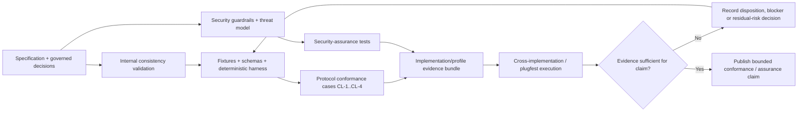

# Conformance and Assurance Evidence Pipeline

## Interpretation

Repository validation, protocol conformance, security assurance and cross-vendor interoperability are different evidence layers. Passing Markdown/schema validators proves internal consistency, not cryptographic correctness or production interoperability. The deterministic harness supplies executable evidence for the cases it actually implements; security-assurance tests evaluate guardrails and threat controls; plugfest evidence is required for claims that depend on independent implementations.

Any published claim must state its level, profile, source revision, environment, evidence set, exceptions and residual-risk decisions. Missing executable or interoperability evidence is a governed limitation, not a result that can be filled by narrative assertion.
