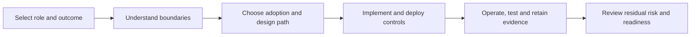

# Guided Learning Paths

Use this page to choose a route through the implementation guide based on the decision you must make and the evidence you must produce. The guide is intentionally lifecycle-oriented: adoption choices precede implementation, deployment introduces controls, operations preserve assurance, and conformance supplies independently reviewable evidence.

## Route 1: sponsor, governance lead or risk owner

| Step | Read | Decision or evidence produced |
|---|---|---|
| 1 | [Adoption pathway](adoption/README.md) | Adoption stage, scope and entry criteria |
| 2 | [Threats, harms and controls](security/README.md) | Assurance boundary and accountable residual-risk owner |
| 3 | [Secure deployment](deployment/README.md) | Deployment profile and control baseline |
| 4 | [Conformance](conformance/README.md) | Required evidence level and acceptance gate |

**Completion test:** you can name the deployment stage, accountable parties, non-claims, minimum controls, evidence package and stop/go authority.

## Route 2: component implementer

| Step | Read | Decision or evidence produced |
|---|---|---|
| 1 | [Architecture](architecture/README.md) | System boundary and trust relationships |
| 2 | [Implementation guides](implementation/README.md) | Role-specific obligations and interfaces |
| 3 | [Scenario corpus](scenarios/README.md) | Expected behaviour under normal and adverse conditions |
| 4 | [Conformance programme](conformance/README.md) | Executable tests and reproducible results |

**Completion test:** every implemented claim traces to a component responsibility, scenario and conformance result.

## Route 3: operator, security reviewer or assessor

| Step | Read | Decision or evidence produced |
|---|---|---|
| 1 | [Secure deployment](deployment/README.md) | Approved security profile and environment assumptions |
| 2 | [Operational playbooks](operations/README.md) | Monitoring, incident, revocation and recovery procedures |
| 3 | [Threats, harms and controls](security/README.md) | Control coverage and residual-risk record |
| 4 | [Conformance](conformance/README.md) | Assessment evidence and disposition |

**Completion test:** an independent reviewer can reconstruct what was authorised, enforced, observed, revoked and accepted.

## Reading discipline

Do not treat cryptographic success as a substitute for governance assurance. At each step record: authority source, delegated scope, enforcement point, revocation path, evidence generated, evidence custodian and residual-risk decision.

[Continue to the adoption pathway →](adoption/README.md)
