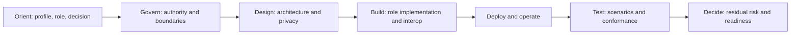

# Guided Learning Paths

Use this page as the **front door** to the implementation guide. Do not read the sidebar from top to bottom as if every page has equal priority. Choose the route that matches the decision you need to make and follow the sequence until you can produce the stated completion evidence.

```mermaid
flowchart LR
  A[Orient: profile, role, decision] --> B[Govern: authority and boundaries]
  B --> C[Design: architecture and privacy]
  C --> D[Build: role implementation and interop]
  D --> E[Deploy and operate]
  E --> F[Test: scenarios and conformance]
  F --> G[Decide: residual risk and readiness]
```

## Interpretation

The flow deliberately places authority and boundary decisions before component construction. Deployment and operations then preserve those decisions in runtime controls, while scenarios and conformance test whether the implementation behaves as claimed. Residual-risk acceptance is therefore an evidence-backed governance decision at the end of a chain, not an assumption made at the beginning.

## The default lifecycle

If you are unsure where to start, use this sequence:

1. **Orient** — understand what the guide does and does not claim.
2. **Adopt** — select profile, maturity stage and production gate.
3. **Design** — fix architecture, assurance/disclosure boundaries, information model and privacy class.
4. **Build** — implement the issuer/wallet/verifier/registry/agent interfaces and DTG dependencies.
5. **Deploy** — select topology and enforce the production security baseline.
6. **Operate** — exercise compromise, revocation, recovery, migration and redress.
7. **Test** — pressure-test scenarios and produce conformance evidence.
8. **Govern change** — keep decisions, ADRs, lifecycle changes and residual-risk acceptance traceable.

## Route 1: sponsor, governance lead or risk owner

| Step | Read | Decision or evidence produced |
|---|---|---|
| 1 | [Implementation Guide overview](README.md) | Scope, non-claims and authority model |
| 2 | [Adoption pathway](adoption/README.md) | Adoption stage, profile and entry criteria |
| 3 | [Assurance and disclosure boundaries](boundaries/README.md) | Reliance/non-reliance and observability boundaries |
| 4 | [Threats, harms and controls](security/README.md) | Accountable residual-risk owner and control baseline |
| 5 | [Production entry criteria](adoption/production-entry-criteria.md) | Documented stop/go authority and evidence gate |

**Completion test:** you can name the permitted scope, profile, accountable parties, non-claims, minimum controls, residual-risk owner, evidence package and stop/go authority.

## Route 2: architect or component implementer

| Step | Read | Decision or evidence produced |
|---|---|---|
| 1 | [Architecture](architecture/README.md) | System boundary and trust relationships |
| 2 | [Assurance and disclosure boundaries](boundaries/README.md) | Predicate reliance and disclosure constraints |
| 3 | [Information model](information-model/README.md) and [privacy engineering](privacy/README.md) | Minimal schema and privacy class |
| 4 | [Component implementation guides](implementation/README.md) | Role-specific obligations and interface contract |
| 5 | [DTG interoperability](interoperability/README.md) | Explicit cross-specification authority/evidence dependencies |
| 6 | [Scenarios](scenarios/README.md) and [conformance](conformance/README.md) | Negative tests and reproducible conformance evidence |

**Completion test:** every implemented claim traces to an authority/boundary decision, component responsibility, adverse scenario and test result.

## Route 3: operator or security engineer

| Step | Read | Decision or evidence produced |
|---|---|---|
| 1 | [Secure deployment](deployment/README.md) | Approved topology and production baseline |
| 2 | [Operations](operations/README.md) | Monitoring, compromise, revocation, recovery and redress playbooks |
| 3 | [Lifecycle and migration](lifecycle/README.md) | Cryptoperiod and migration triggers |
| 4 | [Threats, harms and controls](security/README.md) | Control coverage, metrics and escalation thresholds |
| 5 | [Operational readiness checklist](operations/operational-readiness-checklist.md) | Evidence-backed production readiness record |

**Completion test:** an independent reviewer can reconstruct what was enforced, observed, revoked, recovered and escalated, and by whose authority.

## Route 4: auditor, assessor or interoperability reviewer

| Step | Read | Decision or evidence produced |
|---|---|---|
| 1 | [Auditor and assessor guide](implementation/auditor-assessor-guide.md) | Assessment scope and evidence model |
| 2 | [Requirement index](appendices/REQUIREMENT-INDEX.md) | Claim-to-guidance traceability |
| 3 | [Scenarios](scenarios/README.md) and [pressure tests](pressure-tests/README.md) | Adverse-condition coverage |
| 4 | [Conformance](conformance/README.md) | Repeatable test evidence and dispositions |
| 5 | [Decision governance](decisions/README.md) | Ratification status and unresolved assumptions |

**Completion test:** the assessment distinguishes design, implementation, operation and independent evidence and can identify unresolved authority or assurance gaps.

## Route 5: DTG specification contributor

| Step | Read | Decision or evidence produced |
|---|---|---|
| 1 | [DTG interoperability](interoperability/README.md) | Dependency direction and owning authority |
| 2 | [Cross-specification pressure tests](pressure-tests/README.md) | Findings assigned to the correct control plane |
| 3 | [Decision register](decisions/decision-register.md) | Local vs upstream decision status |
| 4 | [Upstream decision crosswalk](decisions/upstream-decision-crosswalk.md) | Candidate issue/discussion/PR target |

**Completion test:** no local workaround is misrepresented as an upstream specification decision, and each unresolved dependency has an evidence-backed owner.

## Reading discipline

At every stage record: **authority source, delegated scope, enforcement point, revocation path, evidence generated, evidence custodian, privacy/disclosure consequence and residual-risk decision**. If one of those is implicit, the design is not yet independently assessable.

[Continue to the adoption pathway →](adoption/README.md)
