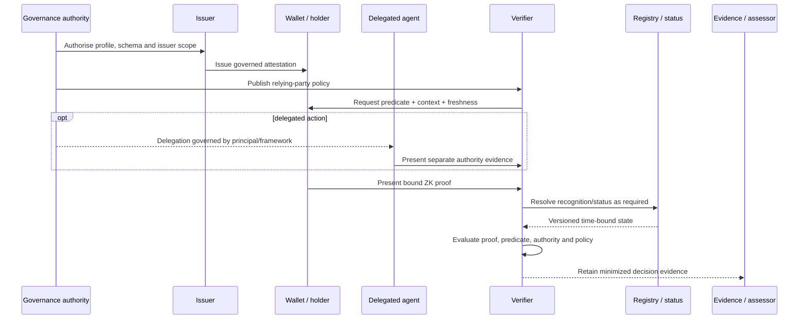

# Component implementation guides

This section turns the guide's architecture, governance boundaries and privacy model into **role-specific implementation obligations**. It is the point at which an abstract proof profile becomes a set of components that can be built, integrated, operated and assessed without collapsing cryptographic validity into governance authority.

{: .decision }
Do not start implementation by selecting a proof library. Start by fixing the predicate, assurance boundary, disclosure boundary, authority sources, lifecycle rules and evidence obligations that the proof mechanism must preserve.

## What this section helps you build

The component guides cover six implementation roles:

| Role | Primary implementation responsibility | Evidence the role should be able to produce |
|---|---|---|
| [Issuer](issuer-implementation-guide.md) | Make and lifecycle-manage governed attestations | Issuance policy/version, schema, key history, status events, correction evidence |
| [Wallet and holder](wallet-holder-implementation-guide.md) | Protect holder-controlled secrets and mediate intentional presentation | Request/consent evidence, local policy decisions, recovery and compromise evidence |
| [Verifier](verifier-implementation-guide.md) | Evaluate proof, status, authority and relying-party policy as separate stages | Decision trace, input versions, reason codes, policy result and evidence references |
| [Registry](registry-implementation-guide.md) | Publish authoritative recognition/status state with time semantics | Signed state, provenance, effective-time history, correction and operator audit evidence |
| [Delegated agent](delegated-agent-implementation-guide.md) | Act only within explicit, bounded and revocable delegation | Delegation record, scope evaluation, step-up result, revocation check |
| [Auditor/assessor](auditor-assessor-guide.md) | Reconstruct claims from independently reviewable evidence | Assessment scope, samples, dispositions, exceptions and residual-risk findings |

A real deployment may combine several roles in one organisation or product. **Logical responsibility must remain separable even when runtime components are co-located.**

## Before you implement

Complete these decisions first. They are upstream inputs to implementation, not optional design commentary.

1. **Profile and predicate.** Select the [profile](../adoption/profile-selection-guide.md) and define the predicate using the [predicate taxonomy](../taxonomy/predicates.md).
2. **Assurance boundary.** Record what a verifier may rely on, what the proof does not establish, and which authority is accountable for each upstream fact. Use the [assurance-boundary workspace](../boundaries/README.md).
3. **Disclosure boundary.** Record who can observe what, including metadata, registry interactions, mediated proving and collusion assumptions. Use the [privacy engineering section](../privacy/README.md).
4. **Context and lifecycle.** Fix context, epoch, status and migration semantics using the [context decision record](../boundaries/context-decision-record.md) and [lifecycle guidance](../lifecycle/README.md).
5. **Authority and interoperability dependencies.** Identify which external DTG specifications supply credential semantics, task context, ceremony context or other governed inputs. See [DTG interoperability](../interoperability/README.md).
6. **Evidence target.** Decide which evidence and conformance level must be produced before coding choices become difficult to reverse. See [conformance](../conformance/README.md).

{: .governance }
If any of these inputs is unresolved, the implementation should expose the uncertainty as a configurable or gated decision. It should not silently encode a local assumption as if it were an agreed DTG rule.

## Shared implementation contract

Every component should implement the following common contract, adapted to its role.

### 1. Make authority explicit

For every decision that affects acceptance, denial, issuance, suspension, delegation or recovery, identify:

- the authority source;
- the policy or schema version;
- the actor allowed to make the decision;
- the scope and effective time of that authority;
- the revocation or supersession path; and
- the evidence needed to reconstruct the decision later.

### 2. Separate cryptographic results from policy results

A successful proof verification is one input into a relying-party decision. Implementations should represent at least these result classes separately:

`parse → request binding → cryptographic verification → predicate evaluation → status/recognition → delegation → relying-party policy → outcome`

Do not compress these stages into a single boolean such as `verified=true` when the caller needs to distinguish *valid proof*, *acceptable issuer*, *current status*, *authorised agent* and *permitted action*.

### 3. Bind every decision to time and versioned state

Evidence should identify the relevant time, policy, schema, registry snapshot or status response, proof profile and software/configuration version. This is necessary to answer the historical question: **why was this outcome valid under the state that applied then?**

### 4. Minimise observability and retention

Do not retain credentials, witnesses, stable identifiers, nullifiers or proof transcripts merely because they are technically available. Retain the minimum evidence needed to establish accountability and reproducibility. Use the [disclosure boundary](../boundaries/disclosure-boundary-template.md) and [observability guidance](../deployment/observability-and-data-minimization.md) to justify retained fields.

### 5. Design failure as a governed state

Implement explicit behaviour for:

- stale or unavailable registries;
- revoked or suspended issuers/credentials;
- expired contexts or epochs;
- replay and transcript mismatch;
- unsupported profiles or algorithms;
- compromise and key rotation;
- ambiguous delegation;
- recovery and reissuance;
- policy disagreement; and
- redress/correction.

Failures should produce stable reason codes and a retry/redress classification rather than an opaque denial.

## Cross-role interaction model

## Interpretation

The interaction separates four distinct control planes: governance authorises roles and policy; issuance creates governed attestations; proving establishes a bounded cryptographic statement; verification combines that statement with current authority, status, delegation and relying-party policy. Evidence spans all four planes so an assessor can reconstruct why an action was accepted or rejected.

The diagram is intentionally layered: the issuer makes an attestation, the wallet proves a predicate, the registry supplies governed state, and the verifier makes the relying-party decision. A delegated agent adds **authority evidence**; it does not inherit authority from possession of a valid proof.

## Implementation sequence

Use this sequence for a new implementation or a substantial redesign.

| Step | Action | Exit evidence |
|---|---|---|
| 1 | Freeze profile, predicate and non-claims | Approved boundary record |
| 2 | Define role interfaces and trust boundaries | Architecture/interface record |
| 3 | Define canonical request, transcript and result semantics | Versioned protocol contract |
| 4 | Implement positive path with synthetic fixtures | Repeatable positive tests |
| 5 | Implement negative and lifecycle paths | Reason-code and failure tests |
| 6 | Add privacy, retention and observability controls | Disclosure assessment |
| 7 | Integrate registry/status and delegation separately | Dependency evidence |
| 8 | Add deployment and operational controls | Deployment evidence package |
| 9 | Run scenario and pressure-test corpus | Scenario dispositions |
| 10 | Produce conformance evidence | Conformance statement and results |

## Interface questions every team should answer

Before declaring a component integration-ready, answer these questions in design or test evidence:

- What exact object crosses the interface, and which fields are normative for this implementation profile?
- Which party is authoritative for each field?
- What freshness and replay protections bind the interaction?
- How are policy, schema, proof profile and registry state versioned?
- What happens when an external dependency is unavailable, stale or contradictory?
- What information can the receiving party retain or correlate?
- Which errors are safe to expose to users, callers and logs?
- How does compromise invalidate or downgrade previous assumptions?
- How is a decision corrected and how can a subject obtain redress?
- Which test or evidence bundle demonstrates the answer?

## Role combinations and separation of duties

Co-location is permitted, but these combinations require explicit controls:

| Combined roles | Principal risk | Required separation evidence |
|---|---|---|
| Issuer + registry operator | Self-recognition or opaque status manipulation | Independent governance authority, signed history, operator audit trail |
| Verifier + mediated prover | Reconstruction of holder data or silent proving | Non-retention controls, request transparency, independently testable privacy claim |
| Wallet + delegated agent | Silent use of holder credentials beyond authority | Separate delegation store, holder policy, scope enforcement and step-up |
| Issuer + verifier | Collusion can weaken privacy assumptions | Declared adversary model, disclosure-boundary analysis, profile-specific controls |
| Operator + assessor | Assurance becomes self-attestation | Independent sampling or explicitly scoped first-party assessment |

## Evidence package expected from an implementation

At minimum, an implementation should be able to assemble:

- implementation identity and version;
- supported profiles, predicates and algorithms;
- schema/policy dependencies;
- authority and registry dependencies;
- component and trust-boundary diagram;
- threat/control mapping relevant to the component;
- test results including negative cases;
- privacy and retention statement;
- lifecycle and compromise behaviour;
- deployment assumptions;
- known limitations and unresolved decisions; and
- conformance claim with evidence references.

The [implementation conformance statement](../conformance/implementation-conformance-statement.md) provides the formal starting point.

## Choose your role guide

If you are implementing more than one role, read each relevant guide and then reconcile the interfaces rather than treating one role's assumptions as internal implementation detail.

- **Issuer team:** [Issuer implementation guide →](issuer-implementation-guide.md)
- **Wallet/prover team:** [Wallet and holder implementation guide →](wallet-holder-implementation-guide.md)
- **Verifier/relying-party team:** [Verifier implementation guide →](verifier-implementation-guide.md)
- **Registry/status team:** [Registry implementation guide →](registry-implementation-guide.md)
- **Agent/delegation team:** [Delegated-agent implementation guide →](delegated-agent-implementation-guide.md)
- **Assurance team:** [Auditor and assessor guide →](auditor-assessor-guide.md)

## What to read next

After component design, move to [DTG interoperability](../interoperability/README.md) for cross-specification dependencies, then [secure deployment](../deployment/README.md) and [operations](../operations/README.md). Before a production claim, use the [scenario corpus](../scenarios/README.md) and [conformance programme](../conformance/README.md) to produce reviewable evidence.
