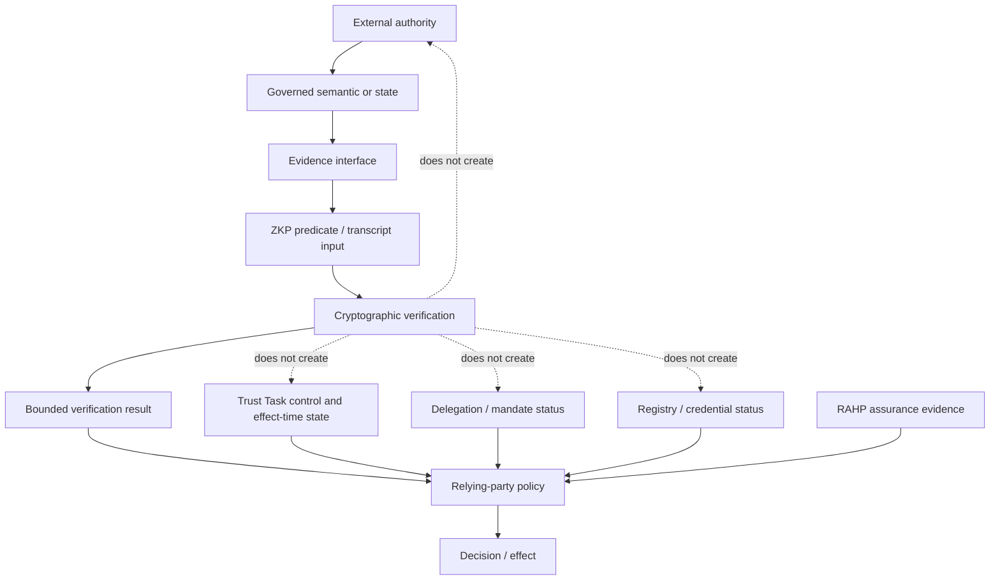

# Authority and evidence boundaries

Interoperability is safe only when evidence crosses repository boundaries without silently transferring authority.



## Interpretation

The diagram separates the owning authority and governed state from the evidence interface consumed by a ZKP profile. Cryptographic verification produces a bounded result, while task-control state, delegation, registry/status evidence and relying-party policy remain independent decision inputs. The dotted non-creation edges make explicit that successful verification cannot mint or override those authorities.

## Boundary rules

1. **Credential authority remains upstream.** A ZKP may prove a predicate over credential evidence but cannot create a credential relationship, edge or subject equivalence not defined by the credential/governance layer.
2. **Edge binding and identifier linkage are separate.** A VWC digest can bind witnessed evidence to an exact relationship edge without proving that P-DID, R-DID and M-DID identifiers represent the same subject/controller.
3. **Task context is binding data, not authority.** Task ids, audiences, challenges, task digests or ceremony references can be bound into a transcript without authorising the action.
4. **Authorization is independent of identity and proof validity.** A recognized issuer, valid proof, valid transport identity or task participant can still be unauthorized for the requested effect.
5. **Authority may need effect-time re-evaluation.** For delayed, suspended, resumed or multi-stage consequential work, status, delegation, policy and task-control evidence can change after initial acceptance.
6. **Task control is a governed runtime input.** Cancel, suspend and resume state belongs to the Trust Task control plane. A cached ZKP cannot override a valid control operation.
7. **Delegation remains separate.** Holder control and delegated authority are independently verifiable claims with independently revocable lifecycle state.
8. **Registry and status state remain runtime evidence.** A mathematically valid proof can still be unacceptable because issuer recognition, credential status, accreditation or applicable policy changed.
9. **RAHP supplies assurance, not normative authority.** DTG RAHP is historical/upstream method provenance; the fork's RAHP Toolkit v1.1 instance supplies executable review machinery. ZKP governance remains responsible for accepting ZKP changes.
10. **Implementations supply evidence, not semantics.** OpenVTC and other implementations can demonstrate interoperability or defects but do not redefine the owning specification by behaviour.
11. **Relying-party policy remains accountable.** The decision authority is responsible for combining the bounded proof result with current external evidence.
12. **Revocation propagates through the owning control plane.** ZKP consumes relevant revoked/suspended state and never invents a parallel revocation authority.

## Effect-time evidence rule

Where a task can outlive the evidence checked at acceptance, the implementation must identify which evidence must be refreshed before the next consequential effect.

Typical examples include:

| Evidence | Possible invalidation | Owning authority |
|---|---|---|
| proof freshness | session/challenge expiry | ZKP profile / verifier policy |
| credential status | revoke/suspend/expire | credential/status authority |
| delegation | revoke/scope expiry/constraint change | mandate/delegation authority |
| task state | cancel/suspend/control operation | Trust Task consumer/control model |
| policy | version supersession/effective-time change | policy/governance authority |
| registry recognition | accreditation/recognition change | registry/governance authority |

The refresh cadence is not universal. It follows the semantic and lifecycle rules of the owning authority.

## Evidence record

Cross-specification verification evidence should identify at minimum:

- proof/profile identifier and version;
- transcript binding digest or equivalent canonical input commitment;
- task id and task digest when task evidence is material;
- evidence type and owning authority;
- source specification/revision or policy version;
- evaluation time and applicable freshness horizon;
- status or revocation result and its evaluation time;
- task-control state where a consequential task is involved;
- delegation/mandate evidence where an agent acts for a principal;
- relationship-edge digest where witnessed relationship evidence is used;
- cross-spec pressure-test id and reviewed revision where applicable;
- relying-party policy version;
- resulting bounded conclusion; and
- evidence retention/erasure rule.

The record should be sufficient to explain **why the decision was acceptable at the relevant time** without retaining unnecessary private witness, biometric or task payload material.

## Revocation and re-evaluation chain

```text
owning authority changes state
        -> evidence becomes stale/revoked/superseded
        -> consuming profile detects or refreshes state
        -> verifier/consumer re-evaluates policy
        -> pending effect proceeds, pauses or fails
        -> decision evidence records the governing state
```

A historical record may establish that evidence was valid **as of T**. It must not be silently interpreted as evidence that the same authority or assurance remains valid now.
