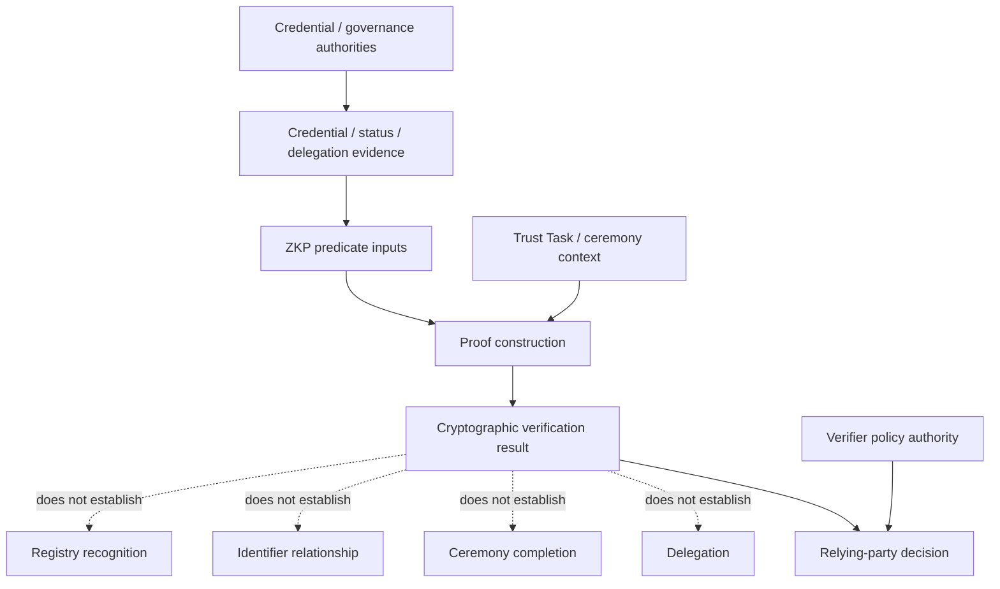

# Authority and evidence boundaries

Interoperability is safe only when evidence crosses repository boundaries without silently transferring authority.

## Boundary rules

1. **Credential authority remains upstream.** The ZKP profile may prove a predicate over a credential but cannot create a credential relationship not defined by the credential/governance layer.
2. **Task context is binding data, not authority.** A Trust Task identifier, challenge or ceremony reference may be bound into a transcript without becoming evidence that the actor was authorised.
3. **Delegation remains separate.** Holder control and delegated authority are independently verifiable claims.
4. **Registry state remains runtime evidence.** A mathematically valid proof can still be unacceptable because issuer recognition, status or policy state changed.
5. **Relying-party policy remains accountable.** The verifier is responsible for deciding whether the proved statement, external status and governance evidence satisfy the action being authorised.
6. **Revocation propagates through the owning control plane.** The ZKP layer must consume relevant revoked/suspended state; it must not invent a parallel revocation authority.

## Evidence record

Cross-specification verification evidence should identify at minimum:

- proof/profile identifier and version;
- transcript binding digest;
- external evidence references and versions;
- authority/source for each external evidence item;
- verification time and applicable policy version;
- unresolved dependency state, if any; and
- decision/result without overstating what the proof established.

## Interpretation

The flow separates evidence production from decision authority. Credential and governance authorities determine source semantics, Trust Task context can bind a proof to an exchange, and verifier policy makes the relying-party decision. The dotted edges identify conclusions that a successful cryptographic verification is not permitted to create.
