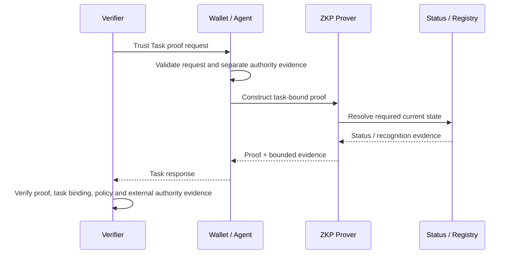

# Trust Ceremony ZKP profile

A ZKP presentation may be one step within a multi-step Trust Ceremony. Ceremony orchestration and proof validity are related evidence domains but remain semantically independent.

## Composition invariants

- ceremony completion **does not imply** ZKP validity;
- ZKP validity **does not imply** ceremony completion;
- ZKP validity **does not imply** delegated authority;
- a ceremony receipt **does not imply** credential or registry validity;
- historical ceremony evidence must be interpreted under the policy and artifact state that applied to the decision being assessed.

## Requirements

### ZKP-CER-01 — Ceremony reference minimisation

If ceremony/enactment context is needed for transcript binding, use the least identifying reference that meets replay and audit requirements. A globally stable ceremony identifier MUST NOT become a cross-context tracking handle by default.

### ZKP-CER-02 — Independent validity

The verifier MUST evaluate proof validity and any required credential/status/authority evidence independently of ceremony completion. Ceremony orchestration MUST NOT override a failed proof or revoked external evidence.

### ZKP-CER-03 — Evidence domain separation

A conformance or audit package MUST distinguish proof evidence, task/ceremony evidence, credential/status evidence and delegated-authority evidence so an assessor can determine which authority produced each conclusion.

## Interpretation

The wallet or agent first validates the request and any separate authority evidence, then constructs a task-bound proof. Status or registry evidence remains independently resolved. The verifier combines these evidence domains under relying-party policy rather than treating any single ceremony, proof or task artifact as sufficient authority.
