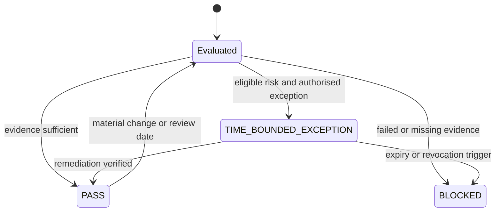

# Security guardrails

Guardrails are activation conditions, not ordinary controls. A deployment or capability may proceed only when the applicable guardrail has evidence in one of three states: `PASS`, `BLOCKED`, or `TIME-BOUNDED EXCEPTION`. Non-exceptionable guardrails permit only `PASS` or `BLOCKED`.

This distinction adapts the RAHP TF separation of controls, guardrails and assurance tests to ZKP deployment decisions. See [RAHP adoption and adaptation](rahp-adoption-and-adaptation.md).

| ID | Guardrail | Applies before | Blocking condition | Exception | Primary evidence |
|---|---|---|---|---|---|
| ZGR-01 | Proof profile integrity | any pilot or production use | security assumptions, parameters or verifier behaviour are unverified | prohibited | profile review, negative vectors, parameter provenance |
| ZGR-02 | Transcript and domain separation | interoperability acceptance | request, audience, profile or protocol binding fails | prohibited | replay and substitution test results |
| ZGR-03 | Context and nullifier governance | scoped uniqueness | context, epoch, rotation or change authority is undefined | prohibited | boundary record, nullifier vectors, authority decision |
| ZGR-04 | Correlation and composition assessment | production entry | combined proof, schema and observable-event leakage is unassessed | time-bounded only for restricted pilot | composition report and privacy review |
| ZGR-05 | Governance-state freshness | reliance decision | status, issuer or policy freshness cannot be bounded | time-bounded degraded mode | signed snapshot and freshness policy |
| ZGR-06 | Mediated-proving isolation | mediated proving | witness isolation, non-retention or operator separation is unverified | prohibited | architecture evidence, retention audit, isolation tests |
| ZGR-07 | Delegated-agent authority | agent activation | delegation scope, audience, expiry or revocation is absent | prohibited | delegation fixture and negative tests |
| ZGR-08 | Fallback disclosure protection | fallback activation | fallback silently increases disclosure or lowers assurance | prohibited | disclosure comparison and user-facing notice |
| ZGR-09 | Redress and correction | high-impact production | contest, evidence access or correction propagation is unavailable | prohibited | redress exercise and propagation test |
| ZGR-10 | Algorithm and migration agility | production or migration | downgrade resistance, deprecation or rollback evidence is absent | time-bounded only for containment | cross-version and migration tests |
| ZGR-11 | Operational evidence readiness | production entry | incident, recovery, authority and audit evidence is incomplete | time-bounded restricted production | signed readiness bundle and exercises |
| ZGR-12 | Accessibility equivalence | general availability | accessible path creates materially greater disclosure or lower assurance | prohibited | accessibility and disclosure comparison |
| ZGR-13 | Risk acceptance integrity | any exception | authority, scope, expiry, evidence or revocation trigger is absent | prohibited | residual-risk approval record |
| ZGR-14 | Monitoring privacy boundary | production monitoring | metric collection creates person-level tracking or unnecessary retention | prohibited | metric data-flow and retention assessment |

## Decision semantics

## Interpretation

The state transition makes activation authority explicit: missing or failed evidence blocks operation, while an eligible exception remains temporary and revocable.

A guardrail record must identify its owner, decision authority, evidence references, applicable threats, applicable harms, review date and revocation triggers. The mapping is maintained in `matrices/guardrail-assurance-map.csv`.
